<p align="center">
  <b>Herramienta de cumplimiento multinorma: relaciona los requisitos del ENS, ISO/IEC 27001, NIS2 e ISO/IEC 42001 con un catálogo común de controles y calcula el grado de cumplimiento de cada norma.</b>
</p>

<p align="center">
  <a href="https://heindall92.github.io/rosetta_multinorma/"></a>
</p>

<p align="center">
  <a href="LICENSE"></a>
  
  
  
  
  <a href="https://github.com/heindall92/rosetta_multinorma/actions/workflows/ci.yml"></a>
  
  
  
</p>

<p align="center">
  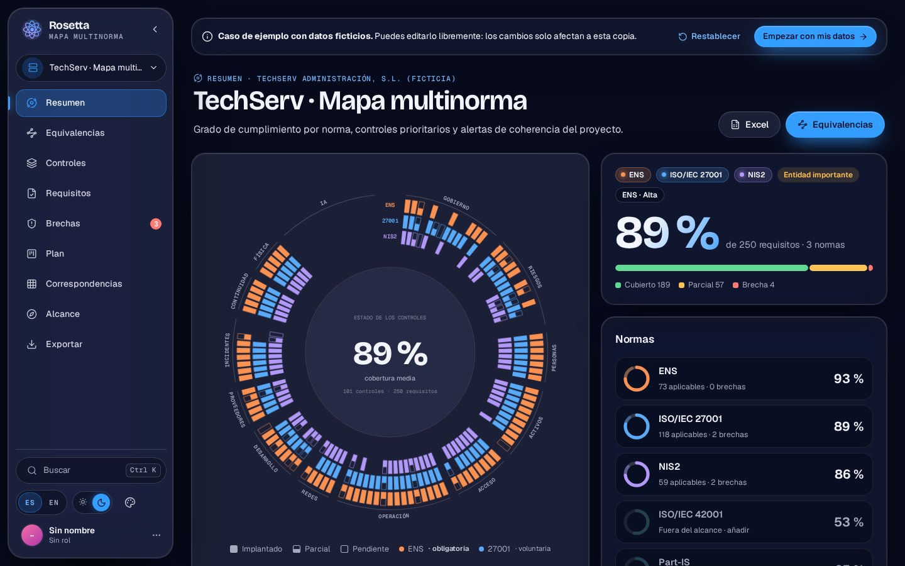
</p>

Rosetta enlaza los **319 requisitos** de cuatro normas con **115 controles unificados** agrupados en 13 dominios. El estado de cada control (implantado, parcial, pendiente o no aplica) se registra una sola vez y la herramienta calcula:

- el grado de cumplimiento de cada norma del alcance y de cada uno de sus requisitos;
- los requisitos sin cubrir y las incoherencias entre normas (11 reglas);
- el orden de implantación, según cuántos requisitos cubre cada control pendiente en todas las normas.

Funciona en el navegador, sin servidor y sin conexión. Los datos del proyecto no salen del equipo.

<div align="center">

## `$ cat rosetta.yaml`

<table>
  <thead>
    <tr>
      <th colspan="2" align="left"><code>rosetta:~$ cat rosetta.yaml</code></th>
    </tr>
  </thead>
  <tbody>
    <tr>
      <td width="50%" valign="top"><code>├─ ⚖ normas:</code><br><br>
        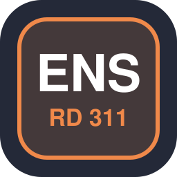
        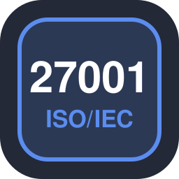
        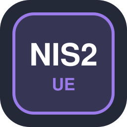
        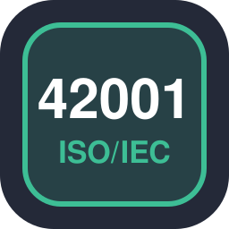<br>
        <sub><code>ENS 77 · ISO/IEC 27001 118 · NIS2 59 · ISO/IEC 42001 65 requisitos</code></sub>
      </td>
      <td width="50%" valign="top"><code>├─ ▣ modelo:</code><br><br>
        
        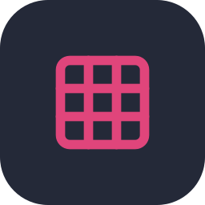
        
        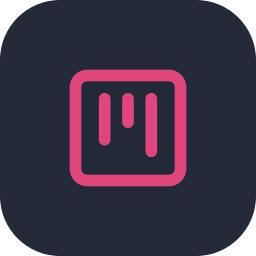<br>
        <sub><code>115 controles · 13 dominios · 11 reglas · plan priorizado</code></sub>
      </td>
    </tr>
    <tr>
      <td valign="top"><code>├─ ✦ aplicacion:</code><br><br>
        
        
        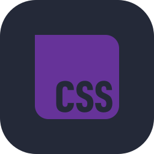
        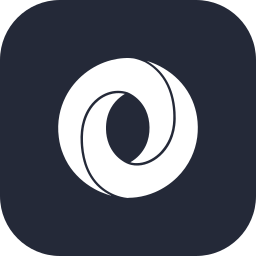
        <br>
        <sub><code>JavaScript · HTML · CSS · JSON · Lucide</code></sub>
      </td>
      <td valign="top"><code>├─ ⚙ build_ci_cd:</code><br><br>
        
        
        
        <br>
        <sub><code>Node.js · Git · GitHub Actions · GitHub Pages</code></sub>
      </td>
    </tr>
    <tr>
      <td valign="top"><code>├─ ◉ pruebas:</code><br><br>
        
        
        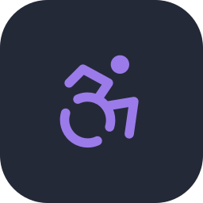
        <br>
        <sub><code>node:test 80 · Playwright 36 · axe-core 0 violaciones · CodeQL</code></sub>
      </td>
      <td valign="top"><code>╰─ ⌁ seguridad:</code><br><br>
        
        
        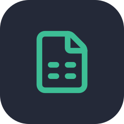
        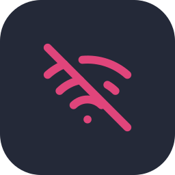<br>
        <sub><code>CSP con hashes · SRI · SheetJS 0.20.3 · cero peticiones a terceros</code></sub>
      </td>
    </tr>
  </tbody>
  <tfoot>
    <tr>
      <td colspan="2"><code>version: 2.3.0&nbsp;&nbsp;·&nbsp;&nbsp;catalogo: 2.2.0&nbsp;&nbsp;·&nbsp;&nbsp;CCN-STIC 825: abril 2026&nbsp;&nbsp;·&nbsp;&nbsp;pruebas: 120 ok&nbsp;&nbsp;·&nbsp;&nbsp;licencia: GPLv2</code></td>
    </tr>
  </tfoot>
</table>

</div>

---

## Índice

- [Cómo se usa](#-cómo-se-usa)
- [Mapa mental](#-mapa-mental)
- [Vistas](#-vistas)
- [Capturas](#-capturas)
- [Arranque rápido](#-arranque-rápido)
- [Arquitectura](#-arquitectura)
- [Método de cálculo](#-método-de-cálculo)
- [Alineación con la CCN-STIC 825](#-alineación-con-la-ccn-stic-825)
- [Calidad](#-calidad)
- [Seguridad y privacidad](#-seguridad-y-privacidad)
- [Auditoría y hoja de ruta a producción](#-auditoría-y-hoja-de-ruta-a-producción)
- [Limitaciones conocidas](#-limitaciones-conocidas)
- [Estructura](#-estructura)
- [Licencia](#-licencia)
- [Autor](#-autor)

---

##  Cómo se usa

1. **Alcance.** Normas aplicables; categoría del ENS y nivel de cada dimensión (D, I, C, A, T); clasificación NIS2 según los arts. 2 y 3 de la Directiva (incluye entidades CER, prestadores de confianza, DORA y exclusiones del art. 2.7–2.8); inclusión de ISO/IEC 42001.
2. **Punto de partida.** Desde cero, desde la Declaración de Aplicabilidad del ENS en Excel (plantilla de 73 medidas) o desde uno de los cinco casos de ejemplo.
3. **Estado de los controles.** Implantado, parcial, pendiente o no aplica, con responsable, evidencias y fecha de revisión. Cada cambio recalcula las normas del alcance y se puede deshacer.
4. **Revisión.** Cobertura por norma y requisito, equivalencias entre normas, brechas, incoherencias y plan de acción.
5. **Entrega.** Excel con una Declaración de Aplicabilidad por norma, informe en Markdown, plan y controles en CSV, proyecto en JSON y copia de seguridad.

##  Mapa mental

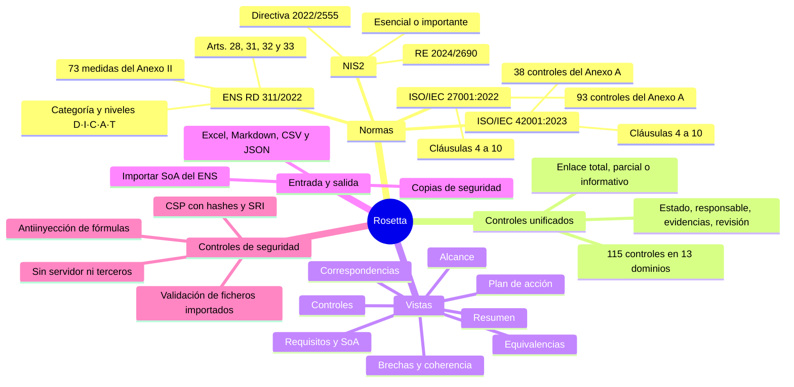

##  Vistas

| | Vista | Contenido |
|---|---|---|
|  | **Resumen** | Grado de cumplimiento por norma, estado de los controles por dominio y norma, controles prioritarios, solapamiento entre normas y alertas de coherencia. |
|  | **Equivalencias** | Para un requisito de cualquier norma: los controles que lo cubren y los requisitos equivalentes en las otras tres, con el tipo de correspondencia (total, parcial o informativa). |
|  | **Controles** | Los 115 controles con su estado, normas a las que sirven, responsable, evidencias y fecha de revisión. |
|  | **Requisitos** | Declaración de aplicabilidad de cada norma: cobertura por requisito, nivel exigido en el ENS y exclusiones justificadas. Las cláusulas 4–10 y los arts. 20, 21 y 23 de NIS2 no se pueden excluir. |
|  | **Brechas** | Requisitos sin cubrir y 11 reglas de coherencia: notificación NIS2 (24 h, 72 h, 1 mes), formación de la dirección, evaluación de impacto de IA, exclusiones contradictorias, controles sin evidencias o sin revisar en 12 meses, entre otras. |
|  | **Plan** | Tablero pendiente, en curso y hecha, ordenado por requisitos cubiertos, con responsable y fecha. |
|  | **Correspondencias** | Requisitos de cada norma por dominio, solapamiento entre normas y tabla completa control ↔ requisitos. |
|  | **Alcance** | Normas aplicables, categoría y niveles del ENS y asistente de aplicabilidad de NIS2. |
|  | **Exportar** | Excel, Markdown, CSV, JSON y copia de seguridad. |

También incluye cinco casos de ejemplo con datos ficticios (proveedor TIC del sector público, hospital, empresa de IA, operador de agua y SaaS para ayuntamientos), varios proyectos en paralelo, buscador global (`Ctrl + K`), deshacer y rehacer (`Ctrl + Z`, `Ctrl + Mayús + Z`), tema claro y oscuro con siete colores de acento, y versión móvil.

##  Capturas

<table>
<tr>
<td width="50%">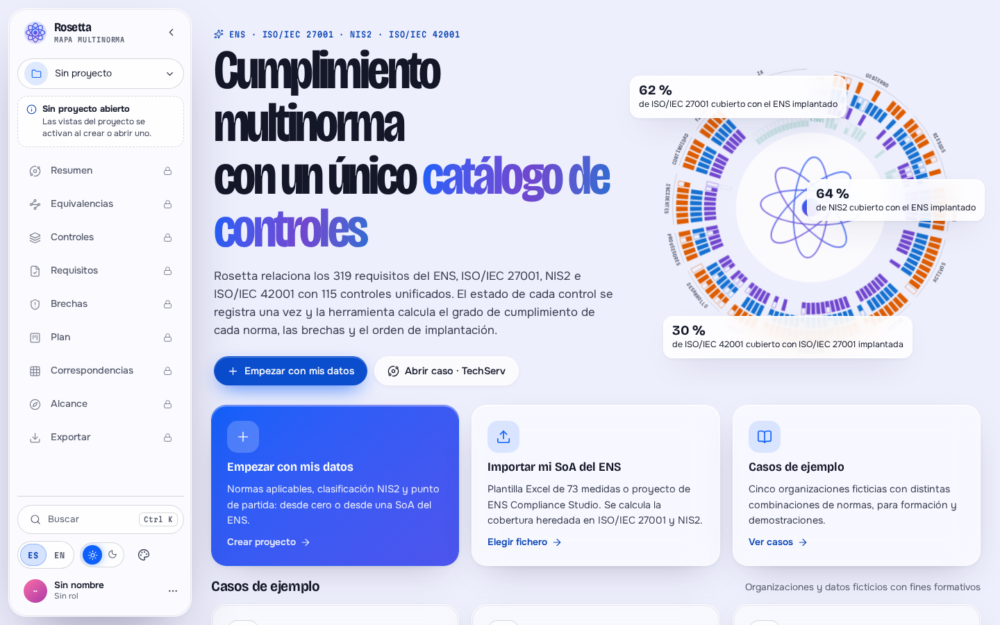<br/><sub><b>Inicio</b> · proyectos, importación de la SoA del ENS y casos de ejemplo</sub></td>
<td width="50%">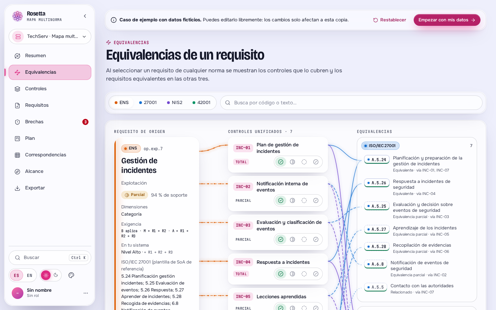<br/><sub><b>Equivalencias</b> · ENS op.exp.7 y sus equivalentes en ISO/IEC 27001, NIS2 e ISO/IEC 42001</sub></td>
</tr>
<tr>
<td>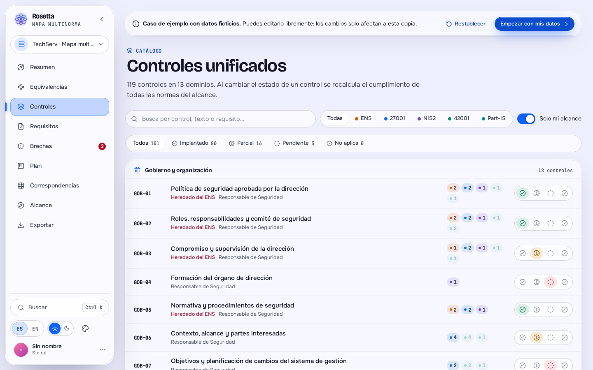<br/><sub><b>Controles</b> · 115 controles en 13 dominios</sub></td>
<td>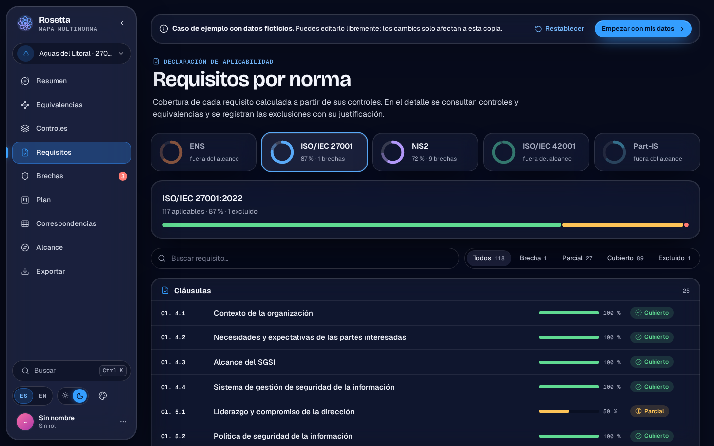<br/><sub><b>Requisitos</b> · declaración de aplicabilidad calculada por norma</sub></td>
</tr>
<tr>
<td>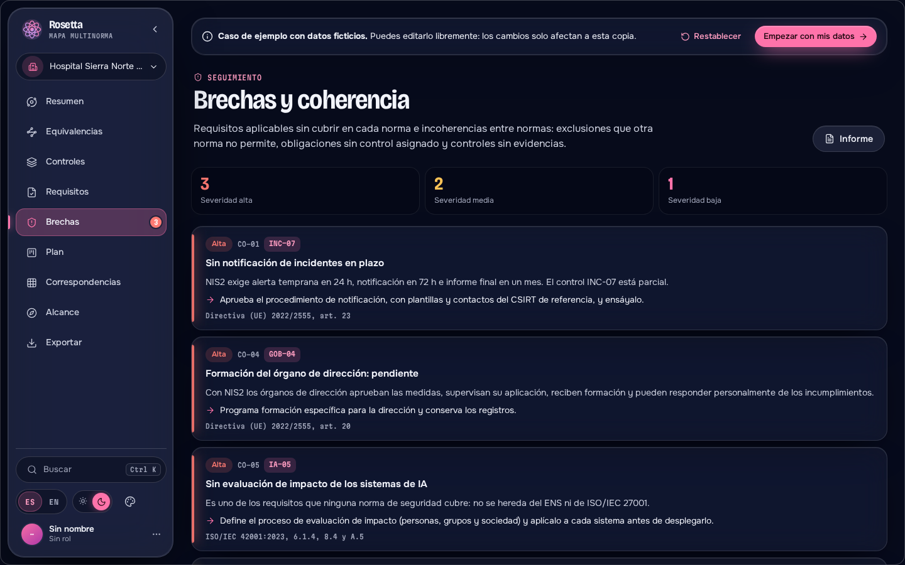<br/><sub><b>Brechas</b> · requisitos sin cubrir e incoherencias entre normas</sub></td>
<td>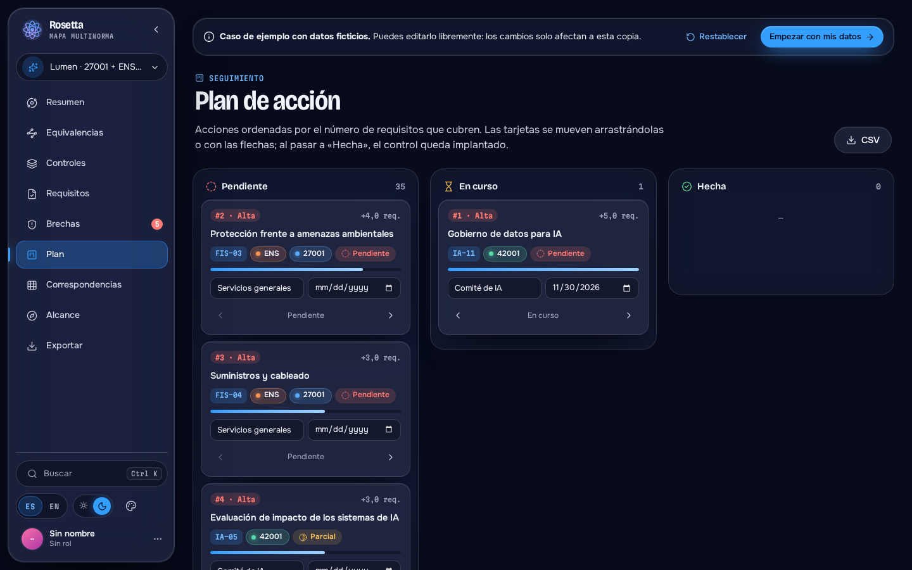<br/><sub><b>Plan de acción</b> · ordenado por requisitos cubiertos</sub></td>
</tr>
<tr>
<td>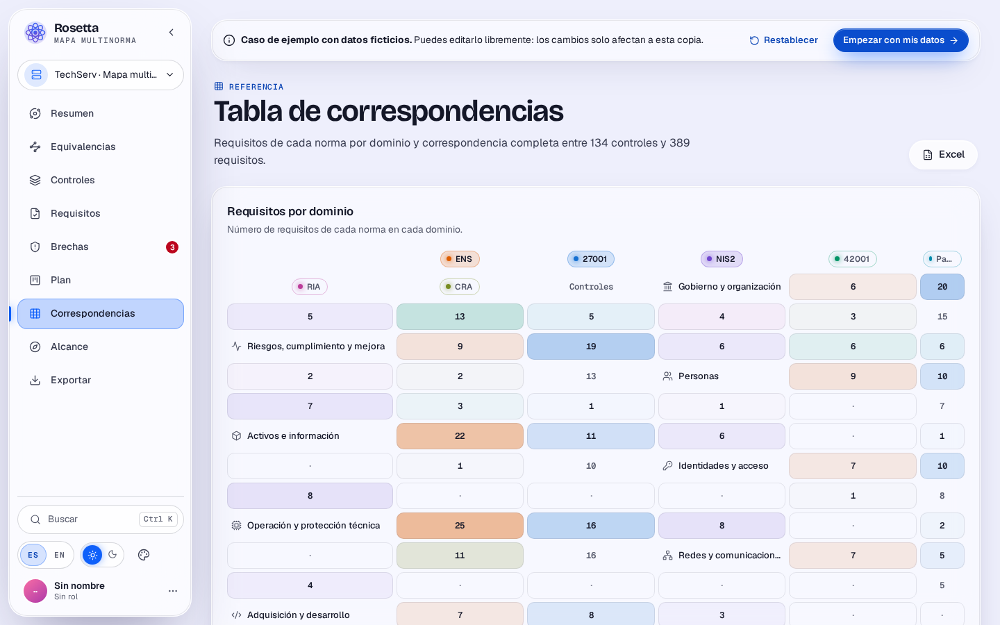<br/><sub><b>Correspondencias</b> · requisitos por dominio y tabla completa</sub></td>
<td>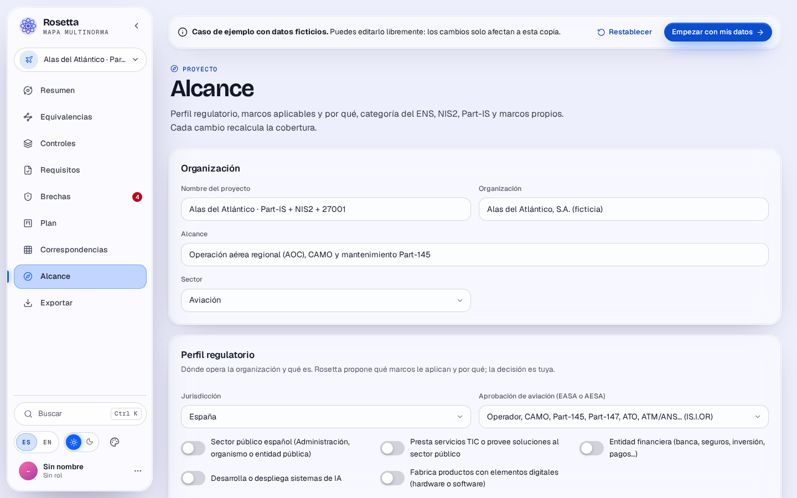<br/><sub><b>Alcance</b> · ENS por niveles y asistente NIS2</sub></td>
</tr>
<tr>
<td colspan="2">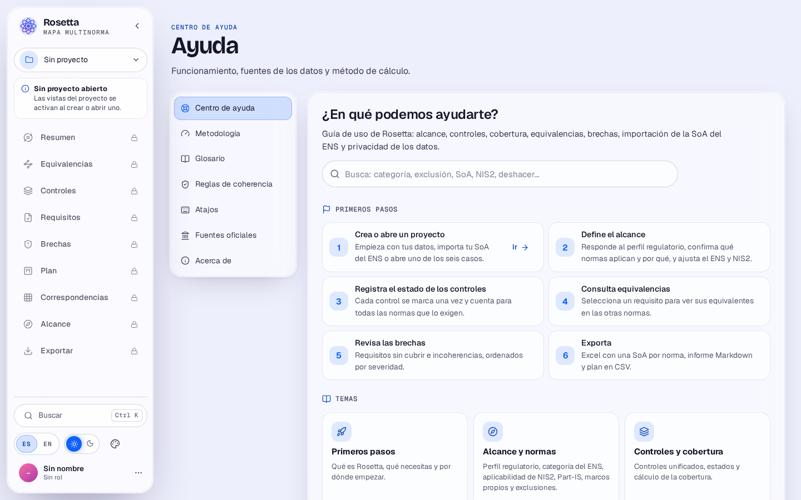<br/><sub><b>Centro de ayuda</b> · buscador, primeros pasos, temas, preguntas frecuentes, fuentes oficiales y contacto</sub></td>
</tr>
</table>

**Barra lateral.** Fija y desplegada desde 1241 px; compacta (solo iconos) entre 901 y 1240 px o al pulsar `[`. En compacta se despliega por encima del contenido al pasar el ratón o al llegar con el teclado, sin desplazar los iconos; el resaltado sigue al puntero.

<p align="center">
  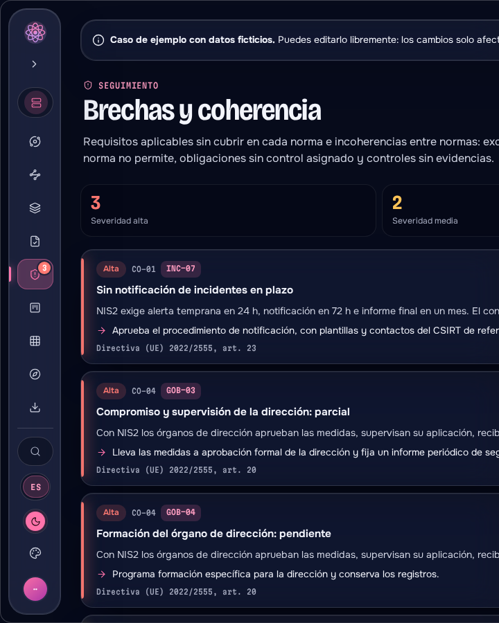
  &nbsp;
  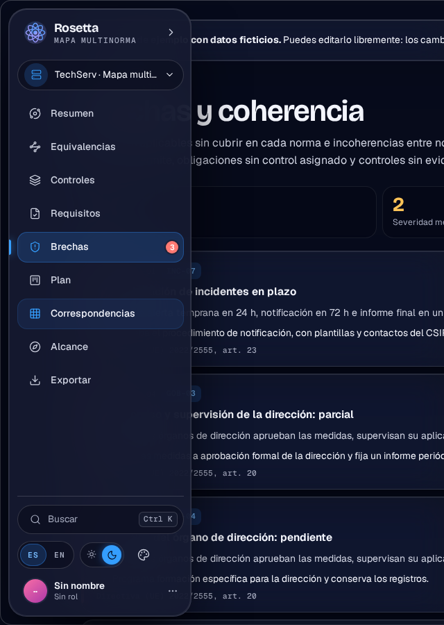
</p>

<p align="center">
  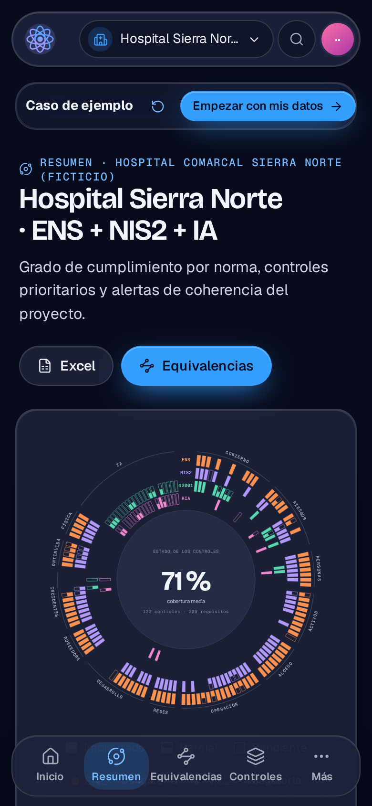
  &nbsp;&nbsp;
  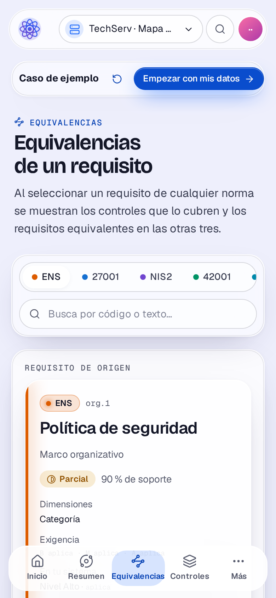
  <br/><sub><b>Móvil</b> · barra inferior con las vistas principales y menú «Más» para el resto</sub>
</p>

##  Arranque rápido

**En línea:** [heindall92.github.io/rosetta_multinorma](https://heindall92.github.io/rosetta_multinorma/). Se publica automáticamente con cada cambio en la rama principal.

**En local, sin instalar nada:** descarga la carpeta [`dist/`](dist/) y abre `index.html`. La importación y exportación de Excel usa la librería incluida en `dist/vendor/`.

**Para desarrollar** (Node.js 20 o superior):

```bash
git clone https://github.com/heindall92/rosetta_multinorma.git
cd rosetta_multinorma
npm ci                 # Playwright y axe-core, solo para las pruebas
npm run build          # src/ → dist/
npm run serve          # http://localhost:5173
```

| Comando | Qué hace |
|---|---|
| `npm run build` | Genera `dist/index.html` (aplicación completa en un fichero) y `dist/vendor/`. |
| `npm run check` | Falla si `dist/index.html` no corresponde a `src/` (lo usa la CI). |
| `npm test` | Motor, integridad del catálogo y build (`node:test`, sin dependencias). |
| `npm run test:e2e` | Aplicación en Chromium: flujos, Excel, CSP, fuentes y accesibilidad. |
| `npm run test:all` | Todo lo anterior. |
| `npm run serve` | Servidor estático local, sin dependencias. |
| `npm run capturas` | Regenera las capturas de este README a partir de `dist/`. |

##  Arquitectura

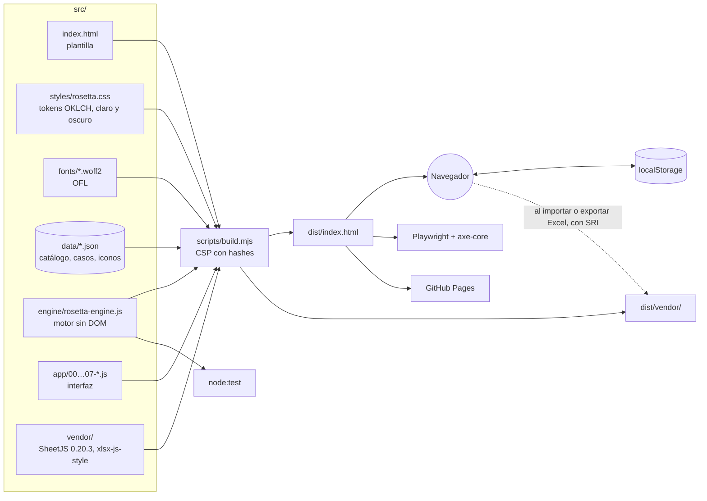

- **Sin framework ni dependencias en ejecución.** JavaScript sin compilar, plantillas y delegación de eventos (`data-act`).
- **Motor independiente de la interfaz.** `rosetta-engine.js` funciona en el navegador (`window.RosettaEngine`) y en Node (`require`), y se prueba sin navegador.
- **Catálogo como datos.** Requisitos, controles, correspondencias y casos en `src/data/*.json`, revisables en cada *pull request*.
- **Build reproducible.** `scripts/build.mjs` resuelve las directivas de la plantilla (`@inline`, `@data`, `@modules`, `@fonts`, `@csp`), incrusta las fuentes y genera la CSP con el hash de cada bloque.

##  Método de cálculo

Cada control se enlaza con requisitos de hasta cuatro normas con un peso: **1** (equivalente), **0,5** (parcial) o **0** (relación informativa, no cuenta). El estado del control vale **1** (implantado), **0,5** (parcial) o **0** (pendiente o no aplica).

$$\text{cobertura}(r) = \max_{c \in r} w_{c,r} \cdot \frac{\sum_{c \in r} w_{c,r} \cdot \text{estado}(c)}{\sum_{c \in r} w_{c,r}}$$

- **Cubierto** al 100 %, **parcial** entre 0 y 100 %, **brecha** en 0. Un requisito con solo enlaces parciales no supera el 50 %.
- **No exigido**: el ENS no lo pide para el nivel de sus dimensiones. **Excluido**: excluido con justificación. Ninguno cuenta en el grado de la norma.
- **Categoría ENS efectiva**: la mayor entre la declarada y la que resulta de los niveles de las dimensiones.
- **Prioridad** de un control pendiente: cobertura que añade en todas las normas del alcance, repartida según su peso en cada requisito.
- **Solapamiento A → B**: parte de B cubierta al implantar los controles que A exige con enlace total.

##  Alineación con la CCN-STIC 825

> **Corrección de la versión 2.3.0, a partir de una revisión externa.** Hasta la 2.2.0, las equivalencias ENS ↔ ISO/IEC 27001 eran de criterio propio, y así lo indicaba la publicación del proyecto. Al revisarla, [Heyker D.](https://www.linkedin.com/in/heykerdas/) (consultor GRC y auditor ENS e ISO/IEC 27001) señaló en LinkedIn que el CCN publica la guía CCN-STIC 825 precisamente para fijar esa correspondencia y evitar interpretaciones. La 2.3.0 corrige el mapa con la guía: 17 equivalencias pasan de totales a parciales, se añaden 5 enlaces y lo que no figura en ella queda marcado como criterio propio. El detalle está en el [informe de alineación](docs/auditoria/05-ccn-stic-825.md) y en [CHANGELOG.md](CHANGELOG.md).

Las equivalencias **ENS ↔ ISO/IEC 27001:2022** siguen la guía oficial del Centro Criptológico Nacional [CCN-STIC 825 «Esquema Nacional de Seguridad. Certificaciones 27001»](https://www.ccn-cert.cni.es/es/series-ccn-stic/guias/series-ccn-stic/800-guia-esquema-nacional-de-seguridad/543-ccn-stic-825-ens-iso27001/file.html) (edición de abril de 2026). Para cada una de las 73 medidas del anexo II, la guía fija un control principal de la ISO, los controles complementarios y un nivel de compatibilidad. Rosetta usa esos datos tal cual:

| Origen en la guía | Parejas | Fuerza en Rosetta |
|---|---|---|
| Control principal, nivel **análogo** (42 medidas) | 71 en total | Equivalente |
| Control principal, **parcialmente análogo** (26 medidas) | ↑ | Parcial |
| Medida **sin equivalente** en la ISO (5: op.pl.5, op.ext.4, mp.info.3, mp.info.4, mp.info.5) | ↑ | Relación, con aviso: no se hereda de una certificación ISO |
| Controles complementarios | 214 | Parcial |
| Cláusulas 4–10 frente al articulado (apdo. 5.2.2) | 34 | La de los controles comunes, al menos parcial |
| Otros controles de la ISO (apdo. 7) | 27 | Relación |
| Equivalencias de Rosetta que no figuran en la guía | 91 | Como mucho parcial, marcadas como **criterio propio** |

- **Los 71 controles principales de la guía comparten un control unificado** con su medida. El catálogo 2.2.0 añade los 5 enlaces que faltaban: org.4 ↔ 5.2, op.acc.5 ↔ 5.18, op.mon.1 ↔ 8.20, mp.if.7 ↔ 7.2 y mp.info.4 ↔ 8.26.
- **Ninguna equivalencia ENS ↔ ISO es total sin respaldo de la guía.** Antes, 17 parejas que el CCN califica de *parcialmente análogas* figuraban como totales; por ejemplo, op.exp.7 ↔ 5.24, op.exp.8 ↔ 8.15 y op.cont.4 ↔ 8.14.
- **Dónde se ve.** En *Equivalencias* y en el panel de detalle, cada equivalencia ENS ↔ ISO indica su origen: control principal, complementario, cláusula u otros controles de la guía, o criterio propio. La ficha de cada medida del ENS muestra su nivel de compatibilidad, la categoría y los controles ISO de la guía.
- **Qué no cambia.** El cálculo de cumplimiento: los enlaces añadidos son de relación (peso 0). La guía decide qué equivale a qué. La cobertura sigue saliendo del estado de los controles unificados.
- **Reproducible.** [`scripts/ccn825.py`](scripts/ccn825.py) regenera [`src/data/ccn825.json`](src/data/ccn825.json) desde el PDF oficial, convertido con MarkItDown, y `--check` comprueba que coinciden. La guía no se incluye en el repositorio: su aviso legal prohíbe reproducirla.
- **Probado.** Ocho pruebas del motor comprueban que no falta ninguna medida ni código, que todos los controles principales están conectados, el reparto 42/26/5, la fuerza por origen, que ninguna equivalencia total carece de respaldo y la simetría ENS → ISO e ISO → ENS.

NIS2 e ISO/IEC 42001 no tienen una guía equivalente: sus correspondencias siguen siendo criterio del autor, contrastado con la guía técnica de ENISA.

##  Calidad

| Suite | Pruebas | Qué comprueba |
|---|---|---|
| Motor (`engine.test.mjs`) | 55 | Media ponderada, techo de los enlaces parciales, exclusiones no permitidas, categoría ENS efectiva, KPI, prioridades, solapamiento, equivalencias, correspondencias de la CCN-STIC 825, aplicabilidad NIS2 (17 casos), cinco casos de ejemplo y una instantánea fija. |
| Catálogo (`catalog.test.mjs`) | 15 | 73 medidas del ENS más 4 artículos, 93 controles de ISO/IEC 27001 y 38 de ISO/IEC 42001, cláusula 6.1.1, art. 23.4 a–e de NIS2, identificadores únicos, enlaces a requisitos existentes, ningún requisito sin control. |
| Build (`build.test.mjs`) | 10 | Determinismo, documento bien formado, datos idénticos a `src/data`, CSP, hashes SRI, fuentes incrustadas, iconos existentes y `dist/` al día. |
| E2E (`e2e.test.mjs`) | 23 | Valores por defecto (claro, español, azul), menú sin proyecto, todas las vistas con los cinco casos, centro de ayuda (buscador y enlaces del autor), barra lateral (anchos, ratón, teclado, tableta), deshacer y rehacer, idioma, tema, móvil, ficheros hostiles, inyección de fórmulas y aviso de almacenamiento lleno. Red bloqueada. |
| Excel, CSP y fuentes (`e2e-excel.test.mjs`) | 13 | Por `file://` y por HTTP: CSP sin violaciones y bloqueando código inyectado, fuentes sin Google Fonts, importación de una SoA del ENS, exportación sin fórmulas y rechazo de una librería manipulada. |
| Accesibilidad (`a11y.test.mjs`) | 4 | axe-core (WCAG 2.2 A/AA) en 12 vistas, claro y oscuro, 1440 y 390 px: cero violaciones. |

La [integración continua](.github/workflows/ci.yml) ejecuta todo en cada *push* y *pull request*, comprueba que `dist/` está al día y audita dependencias cada lunes. [CodeQL](.github/workflows/codeql.yml) analiza el código en cada *push*.

##  Seguridad y privacidad

- **Sin peticiones a terceros.** Fuentes incrustadas; las librerías de Excel se sirven desde `dist/vendor/` con integridad verificada (SRI) y, si faltan, desde jsDelivr con el mismo hash.
- **CSP** generada en el build: `default-src 'none'`, scripts y estilos solo por hash, `connect-src 'none'`.
- **Lectura de Excel con SheetJS 0.20.3**, sin CVE-2023-30533 ni CVE-2024-22363.
- **Validación por esquema** de proyectos, copias, importaciones y `localStorage`: listas blancas, tipos, límites de tamaño e identificadores contrastados con el catálogo.
- **Contaminación de prototipos**: claves peligrosas eliminadas al parsear y `Object.prototype` congelado al arrancar.
- **XSS**: toda salida al DOM pasa por `esc()`.
- **Inyección de fórmulas** en CSV y Excel neutralizada, incluidos espacios iniciales, caracteres invisibles y signos de ancho completo.

Cada defensa tiene una prueba E2E. Para informar de una vulnerabilidad, consulta [SECURITY.md](SECURITY.md).

##  Auditoría y hoja de ruta a producción

Antes de usar Rosetta con datos de clientes se auditaron cuatro áreas: seguridad, exactitud del catálogo frente a las fuentes oficiales, experiencia de uso y accesibilidad, y arquitectura. El resumen, qué se ha corregido y qué queda pendiente está en [docs/AUDITORIA_PRODUCCION.md](docs/AUDITORIA_PRODUCCION.md). Los informes completos están en [docs/auditoria/](docs/auditoria/).

##  Limitaciones conocidas

- **ENS ↔ ISO/IEC 27001 sigue la guía CCN-STIC 825 (abril de 2026)**; el resto de correspondencias (NIS2, ISO/IEC 42001 y las 91 parejas ENS ↔ ISO que la guía no recoge, marcadas en la aplicación) son criterio del autor, contrastado con la plantilla de SoA del curso y con la guía técnica de ENISA. La propia guía advierte que la compatibilidad no es una equivalencia aritmética: revisa el resultado con quien vaya a auditar.
- **Los refuerzos del ENS (R1, R2…) no se modelan por separado**: una medida con refuerzos se evalúa con los mismos controles que sin ellos.
- **Datos sin cifrar en el `localStorage` del navegador.** Todas las páginas de `heindall92.github.io` comparten origen; para datos reales, usa un dominio propio o la copia local, y haz copias de seguridad desde *Exportar*.
- **ISO/IEC 27001 e ISO/IEC 42001 están protegidas por derechos de autor.** Rosetta solo incluye referencias y títulos abreviados.
- **NIS2 en España**: a octubre de 2026 la ley de transposición sigue en tramitación; el asistente aplica la Directiva.

##  Estructura

```
rosetta_multinorma/
│
├── 🧩 src/
│   ├── index.html                Plantilla con directivas del build
│   ├── styles/rosetta.css        Tokens OKLCH, claro y oscuro, 7 acentos, barra lateral y móvil
│   ├── fonts/                    Bricolage Grotesque, Onest, Martian Mono (OFL)
│   ├── engine/rosetta-engine.js  Motor de cálculo sin DOM
│   ├── app/                      Interfaz, por módulos
│   │   ├── 00-i18n.js            Textos en español e inglés
│   │   ├── 01-core.js            Datos, almacenamiento, estado, deshacer
│   │   ├── 01b-security.js       Validación de todo lo que entra
│   │   ├── 02-icons.js           Iconos Lucide en línea
│   │   ├── 03-shell.js           Barra lateral, navegación, tema, avisos
│   │   ├── 04-global.js          Inicio, nuevo proyecto, perfil, ajustes, ayuda
│   │   ├── 05-views.js           Vistas del proyecto
│   │   ├── 05b-inspector.js      Panel de detalle
│   │   ├── 06-io.js              Excel, CSV, Markdown, JSON, importación del ENS, copias
│   │   └── 07-events.js          Eventos y arranque
│   ├── data/
│   │   ├── catalog.json          4 normas · 319 requisitos · 115 controles · 13 dominios
│   │   ├── casos.json            5 casos de ejemplo (ficticios)
│   │   ├── ccn825.json           Correspondencias oficiales ENS ↔ ISO/IEC 27001 (CCN-STIC 825, abril 2026)
│   │   ├── parejas.json          Contraste ENS ↔ ISO/IEC 27001 con la plantilla del curso
│   │   └── icons.json            Iconos SVG (Lucide 1.49)
│   └── vendor/                   SheetJS 0.20.3 (lectura) y xlsx-js-style 1.2.0 (escritura)
│
├── 📦 dist/                      La aplicación generada (index.html + vendor/)
├── 🛠️ scripts/                    build.mjs · serve.mjs · capturas.mjs · ccn825.py
├── 🧪 tests/                      engine · catalog · build · e2e · e2e-excel · a11y · fixtures
├── 📄 docs/                       Auditoría, capturas e iconos del README
└── ⚙️ .github/workflows/          ci.yml · codeql.yml · pages.yml
```

##  Licencia

Distribuido bajo licencia [GPLv2](LICENSE) · © 2026 Yoandy Ramírez Delgado.

Componentes de terceros: iconos de [Lucide](https://lucide.dev) (ISC) y logotipos de [Simple Icons](https://simpleicons.org) (CC0) en la tabla `rosetta.yaml`, cuyas marcas pertenecen a sus titulares; tipografías Bricolage Grotesque, Onest y Martian Mono (SIL Open Font License 1.1), incrustadas; [SheetJS](https://sheetjs.com) 0.20.3 y [xlsx-js-style](https://github.com/gitbrent/xlsx-js-style) 1.2.0 (Apache 2.0); [Playwright](https://playwright.dev) y [axe-core](https://github.com/dequelabs/axe-core) solo para pruebas. ENS, NIS2 y el RE 2024/2690 son normas públicas (BOE, EUR-Lex); ISO/IEC 27001 e ISO/IEC 42001 son obras protegidas de ISO/IEC.

##  Autor

<table>
<tr>
<td align="center" width="100%" valign="top">
<br/>
<b>Yoandy Ramírez Delgado</b><br/>
<sub><b>Diseño y desarrollo de Rosetta</b></sub><br/>
<sub>Junior Pentester · eJPTv2 · AI Governance (ISO 42001) · SysAdmin</sub><br/><br/>
<a href="https://www.linkedin.com/in/yoandyrd92/"></a>
<a href="https://github.com/heindall92"></a>
<a href="https://yoandyramirez.com"></a>
<a href="https://profile.hackthebox.com/profile/019c5812-b4ca-7315-b12f-14db6d2b42fa"></a>
</td>
</tr>
</table>

Otras herramientas GRC del autor: [ENS Compliance Studio](https://github.com/heindall92/grc_ens_compliance_studio) (categorización, riesgos MAGERIT y Declaración de Aplicabilidad; su SoA se importa en Rosetta) y [KAIROS](https://github.com/heindall92/kairos) (continuidad de negocio: BIA, BCP y DRP).

Errores, correspondencias discutibles o propuestas: abre una *issue* o escribe a <a href="mailto:yoandyramirezdelgado@gmail.com">yoandyramirezdelgado@gmail.com</a>.


