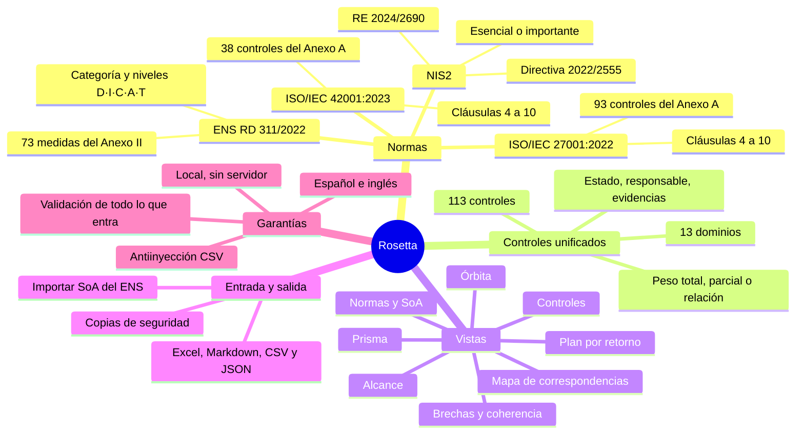
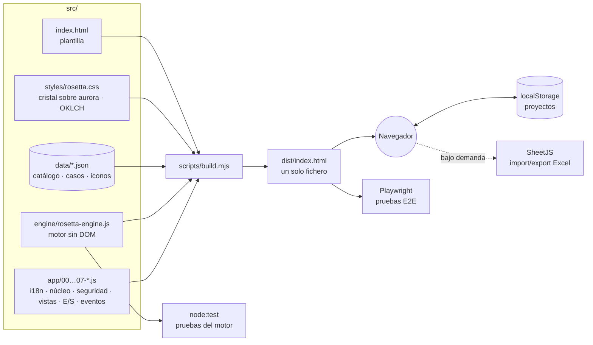

<p align="center">
  <b><i>Implanta cada control una vez. Comprueba al instante qué cubre en cuatro normas, qué falta y qué conviene hacer primero.</i></b>
</p>

<p align="center">
  <a href="LICENSE"></a>
  
  
  
  
  
  
  <a href="https://github.com/heindall92/rosetta_multinorma/actions/workflows/ci.yml"></a>
  
</p>

<p align="center">
  
</p>

**Rosetta es una piedra de Rosetta para el cumplimiento normativo.** Enlaza los **311 requisitos** del Esquema Nacional de Seguridad, ISO/IEC 27001, NIS2 (con el detalle técnico del Reglamento de Ejecución 2024/2690) e ISO/IEC 42001 con **113 controles unificados** en 13 dominios. Marcas el estado de cada control una sola vez y Rosetta recalcula la cobertura de todas las normas del alcance, detecta incoherencias entre ellas y ordena el plan de acción por retorno: primero lo que más requisitos desbloquea.

Es un único fichero HTML que funciona sin servidor, sin instalación y sin conexión: **los datos no salen del navegador**.

---

## Índice

- [Cómo funciona](#-cómo-funciona)
- [Mapa mental](#-mapa-mental)
- [Qué incluye](#-qué-incluye)
- [Capturas](#-capturas)
- [Arranque rápido](#-arranque-rápido)
- [Arquitectura](#-arquitectura)
- [El motor de cálculo](#-el-motor-de-cálculo)
- [Calidad](#-calidad)
- [Seguridad y privacidad](#-seguridad-y-privacidad)
- [Hacia producción](#-hacia-producción)
- [Limitaciones conocidas](#-limitaciones-conocidas)
- [Estructura](#-estructura)
- [Licencia](#-licencia)
- [Autor](#-autor)

---

##  Cómo funciona

1. **Defines el alcance.** Qué normas aplican y cómo: categoría y niveles por dimensión (D·I·C·A·T) del ENS, si eres entidad esencial o importante según NIS2 (un asistente lo deduce de los arts. 2 y 3 de la Directiva) y si entra ISO/IEC 42001.
2. **Partes de lo que ya tienes.** Importas la Declaración de Aplicabilidad del ENS desde Excel y Rosetta hereda el estado de cada control, o empiezas desde cero o desde uno de los cinco casos de ejemplo.
3. **Marcas cada control una vez.** Implantado, parcial, pendiente o no aplica, con responsable, evidencias y fecha de revisión. Cada cambio recalcula las cuatro normas a la vez.
4. **Rosetta traduce y prioriza.** Muestra la cobertura por norma y requisito, las equivalencias entre normas, las brechas, las incoherencias (por ejemplo, una exclusión que otra norma contradice) y un plan de acción ordenado por impacto.
5. **Exportas.** Excel con el mapa completo, informe en Markdown, plan y controles en CSV y el proyecto en JSON. Todo se genera en el navegador, con tu nombre como autor.

##  Mapa mental



##  Qué incluye

| | Vista | Qué resuelve |
|---|---|---|
|  | **Órbita** | La rueda Rosetta: cada rayo es un control y cada anillo una norma. Cobertura media, estado por norma, *siguiente mejor jugada* y cuánto heredas en el resto si ya cumples una. |
|  | **Prisma** | *Un requisito entra, cuatro normas salen*: elige un requisito de cualquier norma y se descompone en sus controles y se proyecta sobre sus equivalentes (total, parcial o relacionado). |
|  | **Controles** | Los 113 controles unificados con su estado, normas a las que sirven, responsable, evidencias y fecha de revisión. |
|  | **Normas** | La declaración de aplicabilidad de cada norma: cobertura calculada por requisito, exclusiones con justificación y nivel exigido en el ENS. |
|  | **Brechas** | Requisitos sin soporte y 11 reglas de coherencia multinorma (notificación NIS2 en 24 h / 72 h / 1 mes, formación de la dirección, evaluación de impacto de IA, exclusiones contradictorias, controles sin evidencias o sin revisar en 12 meses…), por severidad. |
|  | **Plan** | Tablero pendiente → en curso → hecha ordenado por retorno, con responsable y fecha. Al cerrar una tarjeta el control pasa a implantado. |
|  | **Mapa** | Peso de cada norma por dominio, matriz de solapamiento entre normas y tabla completa de correspondencias. |
|  | **Alcance** | Normas en alcance, categoría y niveles del ENS y asistente de aplicabilidad de NIS2. |
|  | **Exportar** | Excel con formato, informe Markdown, plan y controles en CSV, proyecto en JSON y copia de seguridad completa. |

Además: **cinco casos de ejemplo** con datos ficticios (un proveedor TIC del sector público, un hospital, una startup de IA, una empresa de agua y un SaaS para ayuntamientos), varios proyectos a la vez, buscador global (`Ctrl + K`), inspector lateral, tema claro y oscuro con siete acentos, densidad compacta, interfaz en español e inglés y vista móvil con barra inferior.

##  Capturas

<table>
<tr>
<td width="50%"><br/><sub><b>Inicio</b> · casos de ejemplo y proyectos</sub></td>
<td width="50%"><br/><sub><b>Prisma</b> · un requisito del ENS proyectado sobre ISO 27001, NIS2 e ISO 42001</sub></td>
</tr>
<tr>
<td><br/><sub><b>Controles</b> · 113 controles unificados en 13 dominios</sub></td>
<td><br/><sub><b>Normas</b> · declaración de aplicabilidad calculada</sub></td>
</tr>
<tr>
<td><br/><sub><b>Brechas</b> · huecos y coherencia multinorma</sub></td>
<td><br/><sub><b>Plan</b> · tablero ordenado por retorno</sub></td>
</tr>
<tr>
<td><br/><sub><b>Mapa</b> · solapamiento y correspondencias</sub></td>
<td><br/><sub><b>Alcance</b> · ENS por niveles y asistente NIS2</sub></td>
</tr>
</table>

<p align="center">
  
  &nbsp;&nbsp;
  
  <br/><sub><b>Vista móvil</b> · la misma herramienta, con barra inferior</sub>
</p>

##  Arranque rápido

**Para usarla** no hace falta nada: descarga [`dist/index.html`](dist/index.html) y ábrelo en el navegador. Funciona sin conexión.

**Para desarrollar** (Node.js 20 o superior):

```bash
git clone https://github.com/heindall92/rosetta_multinorma.git
cd rosetta_multinorma
npm ci                 # solo Playwright, para las pruebas E2E
npm run build          # src/ → dist/index.html
npm run serve          # http://localhost:5173
```

| Comando | Qué hace |
|---|---|
| `npm run build` | Ensambla `src/` en un único `dist/index.html` autocontenido. |
| `npm run check` | Falla si `dist/index.html` no corresponde a `src/` (lo usa la CI). |
| `npm test` | Pruebas del motor, integridad del catálogo y build (`node:test`, sin dependencias). |
| `npm run test:e2e` | Recorre la aplicación en Chromium con Playwright. |
| `npm run test:all` | Todo lo anterior. |
| `npm run serve` | Servidor estático local, sin dependencias. |

<details>
<summary><b>Publicarla en GitHub Pages</b></summary>

El flujo [`pages.yml`](.github/workflows/pages.yml) construye, prueba y publica `dist/` en cada *push* a `main`. Basta con activar *Settings → Pages → Source: GitHub Actions*.

</details>

##  Arquitectura



- **Sin framework ni dependencias en ejecución.** Vanilla JS con plantillas, delegación de eventos (`data-act`) y un único `render()` por cambio de estado.
- **El motor es independiente de la interfaz.** `rosetta-engine.js` es UMD: se usa igual en el navegador (`window.RosettaEngine`) que en Node (`require`), y por eso se prueba sin navegador.
- **El catálogo son datos, no código.** Requisitos, controles, correspondencias y casos viven en `src/data/*.json`, versionados y revisables en cada *pull request*.
- **Build reproducible.** `scripts/build.mjs` resuelve tres directivas de la plantilla (`@inline`, `@data`, `@modules`), escapa cualquier `</script>` de los datos y produce siempre el mismo fichero.

##  El motor de cálculo

Cada control unificado se enlaza con requisitos de hasta cuatro normas con un peso: **1** (equivalente), **0,5** (parcial) o **0** (relacionado, informativo). El estado del control puntúa **1** (implantado), **0,5** (parcial) o **0** (pendiente o no aplica).

La cobertura de un requisito es la media ponderada de sus controles:

$$\text{cobertura}(r) = \frac{\sum_{c \in r} w_{c,r} \cdot \text{estado}(c)}{\sum_{c \in r} w_{c,r}}$$

- **Cubierto** si llega a 1; **parcial** si está entre 0 y 1; **brecha** si es 0.
- **No exigido** si el ENS no lo pide para el nivel de sus dimensiones; **excluido** si se excluye con justificación. Ninguno de los dos cuenta en el grado de la norma.
- **Prioridad** de un control: la cobertura que añadiría en todas las normas del alcance si se implantase, repartida según su peso en cada requisito.
- **Solapamiento** A → B: qué parte de B quedaría cubierta si se implantasen todos los controles que exige A.

##  Calidad

| Suite | Pruebas | Qué demuestra |
|---|---|---|
| Motor (`tests/engine.test.mjs`) | 38 | Media ponderada, exclusiones, exigencia del ENS por nivel, KPI, prioridades, solapamiento, inferencia, equivalencias del Prisma, aplicabilidad NIS2 (12 casos de los arts. 2 y 3), orden natural de códigos, los cinco casos de ejemplo y una instantánea fija del caso de clase. |
| Catálogo (`tests/catalog.test.mjs`) | 12 | 73 medidas del ENS, 93 controles de ISO 27001 y 38 de ISO 42001; identificadores únicos; todo enlace apunta a un requisito que existe con un peso válido; ningún requisito queda sin control; casos que solo referencian el catálogo. |
| Build (`tests/build.test.mjs`) | 7 | Determinismo, documento bien formado, módulos en orden, datos idénticos a `src/data`, escape de `</script>`, `dist/` al día y ningún `<script src>` externo. |
| E2E (`tests/e2e.test.mjs`) | 16 | Las 14 vistas con los 5 casos sin errores de consola, navegación por el dock, recálculo al cambiar un control, idioma, tema, vista móvil sin desbordamiento y las defensas de abajo, **con la red bloqueada**. |

La [integración continua](.github/workflows/ci.yml) ejecuta todo en cada *push* y *pull request*, comprueba que `dist/` está al día y audita dependencias cada lunes.

##  Seguridad y privacidad

Rosetta trata como no fiable todo lo que entra: ficheros importados, copias de seguridad y hasta su propio `localStorage`.

- **Validación por esquema** de proyectos, copias e importaciones: listas blancas, tipos, límites de longitud y tamaño de fichero; los identificadores se contrastan con el catálogo y lo que no existe no entra en el estado.
- **Contra la contaminación de prototipos**: las claves `__proto__`, `constructor` y `prototype` se eliminan al parsear y `Object.prototype` se congela al arrancar. *Probado en E2E con un fichero hostil.*
- **Contra XSS**: toda salida al DOM pasa por `esc()`; nunca se inserta HTML procedente de datos. *Probado en E2E con un nombre de proyecto que contiene ``.*
- **Contra la inyección de fórmulas en CSV/Excel**: las celdas que empiezan por `=`, `+`, `-`, `@`, tabulador o retorno se neutralizan. *Probado en E2E exportando un control con `=HYPERLINK(…)`.*
- **Privacidad**: no hay servidor, cuentas ni telemetría; los ficheros se generan en el navegador.

¿Has encontrado una vulnerabilidad? Lee [SECURITY.md](SECURITY.md).

##  Hacia producción

Rosetta nació como herramienta formativa y va a trabajar con datos reales de organizaciones reales. La [auditoría para producción](docs/AUDITORIA_PRODUCCION.md) revisa la seguridad, la exactitud del catálogo frente a las fuentes oficiales, la experiencia de uso y la accesibilidad, y propone la arquitectura y la hoja de ruta para llevarla a un entorno profesional.

##  Limitaciones conocidas

- **Las correspondencias entre normas son una ayuda, no una certificación.** Son el criterio experto del autor contrastado con el material de clase; antes de usarlas ante un auditor, revísalas para tu contexto.
- **Los textos de ISO/IEC 27001 e ISO/IEC 42001 están protegidos por derechos de autor de ISO.** Rosetta solo usa referencias y títulos breves; para auditar necesitas la norma con licencia.
- **Los datos viven en el `localStorage` de este navegador**, sin cifrar: borrar los datos del sitio los elimina. Haz copias de seguridad desde *Exportar*.
- **Al cargar se piden las fuentes a Google Fonts** y, solo al importar o exportar Excel, la librería SheetJS a jsDelivr. Sin conexión funciona con fuentes del sistema; el resto de la aplicación no depende de la red.
- **Transposición de NIS2 en España**: el asistente aplica la Directiva; la clasificación definitiva depende de la ley nacional de transposición.

##  Estructura

```
rosetta_multinorma/
│
├── 🧩 src/
│   ├── index.html                Plantilla con directivas @inline / @data / @modules
│   ├── styles/rosetta.css        Sistema de diseño «cristal sobre aurora» (tokens OKLCH, claro/oscuro, 7 acentos)
│   ├── engine/rosetta-engine.js  Motor de cálculo sin DOM (navegador y Node)
│   ├── app/                      Interfaz, por módulos que se concatenan en orden
│   │   ├── 00-i18n.js            Textos en español e inglés
│   │   ├── 01-core.js            Datos, almacenamiento, estado global
│   │   ├── 01b-security.js       Validación de todo lo que entra
│   │   ├── 02-icons.js           Iconos Lucide en línea
│   │   ├── 03-shell.js           Dock, navegación, tema, avisos
│   │   ├── 04-global.js          Inicio, nuevo proyecto, perfil, ajustes, ayuda
│   │   ├── 05-views.js           Órbita, Prisma, Controles, Normas, Brechas, Plan, Mapa, Alcance, Exportar
│   │   ├── 05b-inspector.js      Panel lateral de detalle
│   │   ├── 06-io.js              Excel, CSV, Markdown, JSON, importación del ENS, copias
│   │   └── 07-events.js          Eventos y arranque
│   └── data/
│       ├── catalog.json          4 normas · 311 requisitos · 113 controles · 13 dominios
│       ├── casos.json            5 casos de ejemplo (ficticios)
│       ├── parejas.json          Contraste ENS ↔ ISO 27001 del material de clase
│       └── icons.json            Iconos SVG (Lucide)
│
├── 📦 dist/index.html            La aplicación, en un solo fichero (generado)
├── 🛠️ scripts/                    build.mjs · serve.mjs
├── 🧪 tests/                      engine · catalog · build · e2e
├── 📄 docs/                       Auditoría, capturas e iconos del README
└── ⚙️ .github/workflows/          ci.yml · pages.yml
```

##  Licencia

Distribuido bajo licencia [GPLv2](LICENSE) · © 2026 Yoandy Ramírez Delgado.

Componentes de terceros: iconografía de [Lucide](https://lucide.dev) (ISC); tipografías Bricolage Grotesque, Onest y Martian Mono (SIL Open Font License) servidas por Google Fonts; [xlsx-js-style](https://github.com/gitbrent/xlsx-js-style) (Apache 2.0), cargada bajo demanda; [Playwright](https://playwright.dev) (Apache 2.0) solo para pruebas. ENS, NIS2 y el RE 2024/2690 son normas públicas (BOE, EUR-Lex); ISO/IEC 27001 e ISO/IEC 42001 son marcas y obras protegidas de ISO/IEC.

##  Autor

<table>
<tr>
<td align="center" width="100%" valign="top">
<br/>
<b>Yoandy Ramírez Delgado</b><br/>
<sub><b>Idea, diseño y desarrollo de Rosetta</b></sub><br/>
<sub>Junior Pentester · eJPTv2 · AI Governance (ISO 42001) · SysAdmin</sub><br/><br/>
<a href="https://www.linkedin.com/in/yoandyrd92/"></a>
<a href="https://github.com/heindall92"></a>
<a href="https://yoandyramirez.com"></a>
<a href="https://profile.hackthebox.com/profile/019c5812-b4ca-7315-b12f-14db6d2b42fa"></a>
</td>
</tr>
</table>

¿Encontraste un problema o una correspondencia mejorable? Abre una *issue* o escribe a <a href="mailto:yoandyramirezdelgado@gmail.com">yoandyramirezdelgado@gmail.com</a>.


<div align="center">

**Rosetta** — *Una norma entra, cuatro salen*

</div>
